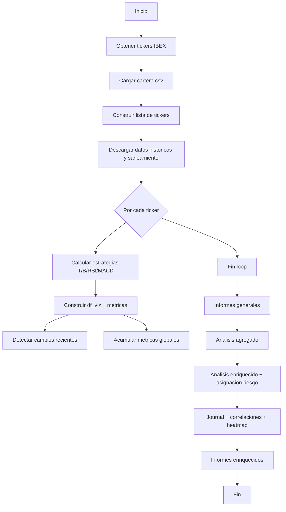

# Documento funcional detallado
# Sistema: EstrategiaCombinadaRSI.py (v16.0)

## 1) Proposito y alcance
Este programa ejecuta un analisis cuantitativo completo sobre activos del IBEX 35 y la cartera personal del usuario. Calcula cuatro estrategias tecnicas (tendencia, Bollinger, RSI, MACD), una estrategia combinada ponderada, y produce informes en PDF/HTML/CSV con metricas, estados de señal, asignacion por riesgo y seguimiento operativo.

El objetivo es:
- Evaluar rendimiento historico y riesgo por activo y por estrategia.
- Detectar entradas/salidas recientes y estado operativo actual.
- Generar material de decision (tablas, dashboards, recomendaciones y alertas).
- Mantener un journal persistente de senales ejecutables.

## 2) Entradas del sistema

### 2.1 Datos externos
- Yahoo Finance via `yfinance`: series historicas OHLCV, `Adj Close`, dividendos.
- Wikipedia (IBEX 35): composicion actual de tickers y nombres.

### 2.2 Archivos locales
- `cartera.csv` (opcional): movimientos del usuario. Columnas requeridas: `Ticker`, `Tipo`, `Cantidad`, `Precio`, `Fecha`.
- `journal_operaciones*.csv` (opcional): historico de senales previas para consolidacion.

### 2.3 Configuracion interna y constantes
- Fecha inicio base: `2020-01-01`.
- Fecha fin: `2026-01-28` (fija en el script).
- Costes de transaccion: `0.001` (0.1% por operacion).
- Pesos combinados: 25% cada estrategia.
- Parametros:
  - Tendencia: SMA corta 50, SMA larga 140.
  - Bollinger: ventana 30, 2.5 desv.
  - RSI: ventana 14, compra < 30, salida > 55.
  - MACD: 12/26/9.

### 2.4 Variables de entorno
- No se requieren variables de entorno.

## 3) Salidas y artefactos

### 3.1 Informes PDF
- `INFORME_INDIVIDUAL_YYYYMMDD.pdf` (por ticker con graficos y tabla de metricas).
- `INFORME_AGREGADO_YYYYMMDD.pdf` (rendimiento medio de la cartera).
- `INFORME_DETALLADO_METRICAS_YYYYMMDD.pdf` (tabla extensa de metricas + estado operativo).
- `INFORME_RESUMEN_GANADORES_YYYYMMDD.pdf` (mejor estrategia por Sharpe).
- `INFORME_CAMBIOS_ESTADO_YYYYMMDD.pdf` (entradas/salidas recientes).
- `DASHBOARD_INDICADORES_TECNICOS_YYYYMMDD.pdf` (snapshot tecnico).
- `INFORME_RECOMENDACION_PERFILES_YYYYMMDD.pdf` (carteras por perfil).
- `Inversion_Estrategica_Largo_Plazo_YYYYMMDD.pdf` (seleccion buy&hold).
- `Analisis_tecnico_tabla_completa_enriquecido_YYYYMMDD.pdf` (semaforo + niveles + alertas).
- `Asignacion_por_riesgo_enriquecido_YYYYMMDD.pdf` (pesos por riesgo + heatmap).
- `INFORME_MI_CARTERA_YYYYMMDD.pdf` (P&L personal con dividendos).

### 3.2 Otros formatos
- `ANALISIS_3D_INTERACTIVO_YYYYMMDD.html` (plot 3D interactivo).
- `dashboard_data_YYYYMMDD.csv` (datos del dashboard tecnico).
- `journal_operaciones_hasta_YYYYMMDD.csv` (journal consolidado con estado y P&L).
- `heatmap_sectores.png` (mapa sectorial IBEX 35).

## 4) Modelo de datos y estructuras clave

### 4.1 DataFrame historico principal
Salida de `obtener_datos_historicos`:
- `ticker`, `date`, `open`, `high`, `low`, `close`, `volume`, `daily_return`, `dividends`.

### 4.2 DataFrame de backtest por estrategia
Por estrategia: columnas base +
- `signal`, `position`, `signal_shifted`.
- `strategy_return`.
- `market_cumulative_return`, `strategy_cumulative_return`.

### 4.3 DataFrame `df_viz` (panel tecnico unificado)
Incluye:
- Precio y OHLC: `close`, `high`, `low`.
- Tendencia: `sma_short`, `sma_long`, `position_tendencia`.
- Bollinger: `sma_bollinger`, `banda_superior`, `banda_inferior`, `position_bollinger`.
- RSI: `rsi`, `position_rsi`.
- MACD: `macd`, `macd_signal`, `macd_histogram`, `position_macd`.
- Volumen y volatilidad: `rvol`, `atr`, `atr_perc`.
- Regimen: `adx`.
- Amplitud: `sma_200`.
- Retornos acumulados: `*_cumulative_return`.

### 4.4 Estructura `data_enriquecida`
Lista de dicts con:
- `Ticker`, `Precio`.
- `Semaforo`: VERDE/AMARILLO/ROJO.
- `Estado`: EJECUTAR/VIGILAR/NO EJECUTAR.
- `Setup`: Breakout/Pullback.
- `Score`, `Entrada`, `Stop`, `T1`, `T2`, `Trailing_Stop`.
- `Inputs` con variables normalizadas.

## 5) Pipeline funcional detallado

### 5.1 Obtencion de tickers IBEX
`obtener_componentes_ibex()`:
- Descarga la tabla desde Wikipedia.
- Extrae columnas Ticker/Empresa.
- Aplica correcciones manuales (`CORRECCIONES_MANUALES_WIKIPEDIA`).
- Si falla, usa lista de respaldo hardcode.
- Agrega `^IBEX` como indice.

### 5.2 Carga de cartera personal
`cargar_cartera()`:
- Lee `cartera.csv` en UTF-8 o Latin-1.
- Normaliza `Ticker`, `Tipo`, `Fecha`.
- Calcula posicion neta (compras - ventas).
- Calcula precio medio ponderado por compras.
- Devuelve DataFrame de posiciones activas, tickers y fecha mas temprana.

### 5.3 Descarga y saneamiento de datos
`obtener_datos_historicos(tickers, start, end)`:
- `yfinance.download` con `auto_adjust=False` para preservar dividendos.
- Ajusta OHLC manualmente usando `Adj Close`.
- Convierte a formato largo, pivotea por metricas.
- Garantiza columna `dividends` (relleno 0).
- Detecta splits huérfanos: caidas > 50% estables y corrige historicos previos.
- Calcula `daily_return`.

### 5.4 Estrategias individuales
Todas son long-only y aplican costes de transaccion.

**Tendencia (SMA)**
- Señal = 1 si SMA corta > SMA larga.
- Retorno estrategico = `daily_return * signal_shifted - coste`.

**Bollinger Reversion**
- Compra si `close < banda_inferior`.
- Sale si `close > sma`.

**RSI Reversion**
- Compra si RSI < umbral compra.
- Sale si RSI > umbral salida.

**MACD**
- Compra en cruce MACD sobre signal.
- Venta en cruce MACD bajo signal.

### 5.5 Estrategia combinada
`ejecutar_analisis_completo_individual(...)`:
- Calcula las 4 estrategias.
- Combina retornos ponderados por `PESOS_ESTRATEGIAS`.
- Calcula metricas de la combinada.
- Genera `df_viz` con indicadores adicionales (RSI, MACD, ATR, RVOL, ADX, SMA200).

### 5.6 Analisis agregado (cartera media)
`ejecutar_analisis_completo_agregado(...)`:
- Ejecuta estrategias en cada ticker (sin indices).
- Promedia retornos diarios entre activos.
- Calcula metricas del “activo agregado”.
- Produce `df_viz_agregado` para graficar.

### 5.7 Informes generales

**`crear_informe_pdf`**
- Para cada ticker: grafico de precio + señales y equity curves.
- Tabla de metricas (CAGR, Vol, Sharpe, MaxDD).

**`generar_pdf_detalles_estado`**
- Tabla extensa de metricas por estrategia y estado/operaciones.

**`generar_pdf_resumen_ganadores`**
- Estrategia con mejor Sharpe por activo.

**`generar_pdf_cambios_estado`**
- Detecta entradas/salidas recientes (ultimas 5 fechas de trading).

**`generar_pdf_dashboard_tecnico`**
- Snapshot tecnico: RSI, %B, ADX, RVOL, ATR%, soportes/resistencias.
- Exporta `dashboard_data_YYYYMMDD.csv`.

**`generar_informe_estrategico_largo_plazo`**
- Filtra activos por CAGR > 10%, Sharpe > 0.60 y MaxDD > -30%.

**`generar_recomendacion_perfiles`**
- Genera carteras para perfiles Conservador/Neutral/Agresivo.
- Criterios de filtrado y ranking diferentes por perfil.

**`generar_grafico_3d_activos`**
- Scatter 3D (Vol, Sharpe, MaxDD) con plano de tendencia.

### 5.8 Analisis enriquecido determinista
`calcular_analisis_enriquecido` traduce reglas a logica Python:
- Calcula distancia a soporte/resistencia y ATR.
- Determina `Setup` (Breakout/Pullback) con reglas:
  - Breakout si tendencia y MACD alcistas y distancia a resistencia <= 2%.
  - Pullback si distancia a soporte <= 5% o RSI <= 45.
- Define `Entrada`, `Stop`, `T1`, `T2`, `Trailing_Stop`.
- Semaforo:
  - ROJO si SMA bajista y MACD bajista.
  - VERDE si condiciones de tendencia + ADX + distancia + RVOL >= 0.15.
  - AMARILLO en caso contrario.
- Score ponderado por direccion, ADX, ubicacion, RSI y volumen.

### 5.9 Asignacion por riesgo
`calcular_pesos_inversion_enriquecido`:
- Solo activos con `Estado = EJECUTAR`.
- Peso inverso a la distancia al stop.
- Opcion 2 limita banca al 25% si excede.

### 5.10 Correlaciones de riesgo
`calcular_correlaciones_ejecutables`:
- Correlacion de retornos (ultimos 60 dias) para activos en EJECUTAR.
- Alerta si correlacion > 0.85.

### 5.11 Journal de operaciones
`gestionar_journal_operaciones`:
- Consolida `journal_operaciones*.csv`.
- Inserta nuevas senales VERDE si no existen abiertas.
- Actualiza estado por stop, target o deterioro.
- Calcula P&L (%) y guarda en `journal_operaciones_hasta_YYYYMMDD.csv`.

## 6) Reglas y criterios detallados

### 6.1 Parametros clave de la estrategia enriquecida
- Breakout: entrada = resistencia + 0.25 * ATR.
- Pullback: entrada = soporte + 0.50 * ATR.
- Stop inicial = nivel - 1.00 * ATR.
- T1 = entrada + 1R, T2 = entrada + 2R.
- Trailing stop = precio actual - 2.5 * ATR.

### 6.2 Semaforo
- ROJO: SMA bajista y MACD bajista.
- VERDE (Breakout): SMA alcista, MACD alcista, ADX Trend/Neutral, dist_res <= 2%, RSI no sobrecomprado, RVOL >= 0.15.
- VERDE (Pullback): dist_sop <= 5%, ADX Trend/Neutral, RSI <= 45 o sobreventa, RVOL >= 0.15.
- AMARILLO: resto de casos.

## 7) Formulas de metricas (Anexo)

### 7.1 Retornos
- `daily_return = close.pct_change()`
- `cumulative_return = (1 + r).cumprod()`
- `total_return = cumulative_return[-1] - 1`

### 7.2 CAGR
- `years = days / 365.25`
- `CAGR = (1 + total_return)^(1 / years) - 1`

### 7.3 Volatilidad anualizada
- `vol = std(daily_return) * sqrt(252)`

### 7.4 Sharpe geometrico
- `sharpe = CAGR / vol` (si `vol != 0`)

### 7.5 Drawdown
- `peak = cumulative_return.cummax()`
- `drawdown = (cumulative_return - peak) / peak`
- `max_drawdown = drawdown.min()`

### 7.6 Indicadores tecnicos
- SMA: media movil simple.
- Bollinger: `sma +/- std * num_std_dev`.
- RSI: media de ganancias/perdidas en ventana.
- MACD: EMA(12) - EMA(26), signal EMA(9).
- ATR(14): media del maximo de `tr1, tr2, tr3`.
- RVOL: `volume / SMA(volume, 20)`.
- ADX(14): medida de fuerza de tendencia.

## 8) Comportamiento ante errores
- Si falla Wikipedia: lista de respaldo.
- Si falla descarga: el analisis no continua.
- Si faltan dividendos: se crea columna con ceros.
- Informes capturan excepciones y siguen con el siguiente ticker.
- Sin dependencias de IA ni claves externas.

## 9) Diagrama de flujo (Mermaid)

## 10) Archivos de referencia
- Script principal: `C:\dev\opencode\Prueba\EstrategiaCombinadaRSI.py`
- Documento funcional: `C:\dev\opencode\Prueba\Documento_Funcional_EstrategiaCombinadaRSI.md`
